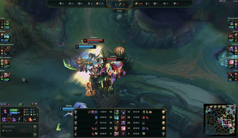

# LOL Replays
Using Riot's public matches API, this script can find any live match and record the gameplay.


### Usage

```
RIOT_API_KEY=<KEY> poetry run python riot-spectate.py
```

Runtime settings, watched summoners, and champion filters are configured in `config.yaml`.

### Example Clip (Shortened)

